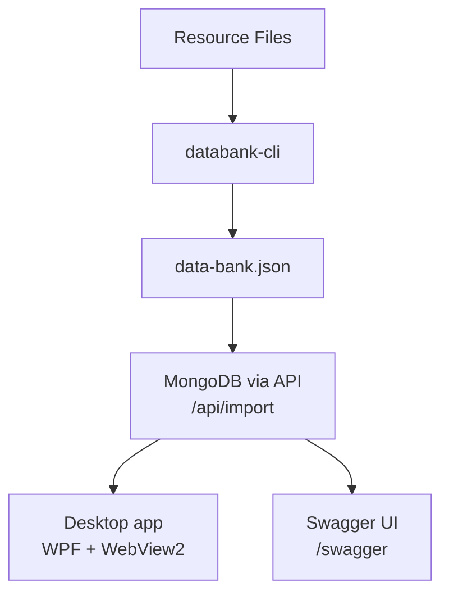

# DatabankTool

A localization data extraction and management pipeline for DeltaV. Extracts translatable strings from resource files (.resx, .rc, .fhx, .ahc, .json, .grf), stores them in MongoDB, and provides a desktop and web interface for browsing and managing translations.

This can be used to aggregate localization-related KEYS and manage translation values in the desktop app

## Table of Contents

- [Quick How to Run](#quick-how-to-run)
  - [Prerequisites](#prerequisites)
  - [Option 1: CLI extraction → Local mode](#option-1-cli-extraction--local-mode-no-server)
  - [Option 2: Full Stack → Remote mode](#option-2-full-stack--remote-mode-mongodb--api)
  - [Option 3: Desktop App](#option-3-desktop-app-either-mode)
  - [Connecting to MongoDB Compass](#connecting-to-mongodb-compass)
- [Architecture](#architecture)
- [Sub-Projects](#sub-projects)
- [Makefile Commands](#makefile-commands)
- [CLI Reference](#cli-reference)
- [Supported File Formats](#supported-file-formats)
- [API Endpoints](#api-endpoints)
- [Desktop App Modes](#desktop-app-modes)
  - [Local Mode](#local-mode)
  - [Remote Mode](#remote-mode)
- [Common Things to Do in the Desktop App](#common-things-to-do-in-the-desktop-app)
- [Common Workflows](#common-workflows)
  - [Extract and browse locally](#extract-and-browse-locally-no-server)
  - [Full pipeline with API](#full-pipeline-with-api-remote-mode)
  - [Re-import updated data](#re-import-updated-data)

## Quick How to Run

### Prerequisites

- [.NET 10 SDK](https://dotnet.microsoft.com/download) (or later)
- [Docker Desktop](https://www.docker.com/products/docker-desktop/) (only needed for Remote mode — MongoDB)
- [MongoDB Compass](https://www.mongodb.com/compass) (optional, for visual DB inspection)

The desktop app has two modes:

- **Local** - import a `data-bank.json` produced by the CLI and browse it offline (no server).
- **Remote** - connect to the REST API backed by MongoDB.

> [!NOTE]
> The app starts in **Local** mode by default. Switch to **Remote** mode in the toolbar to connect to a running API (see [Desktop App Modes](#desktop-app-modes)).

---

### Option 1: CLI extraction → Local mode (no server)

1. Extract translatable strings from a directory of resource files into `data-bank.json`:

> [!NOTE]
> Point a resource folder (where all localization-related keys are stored) to extract the KEYS --> This is the `INPUT_DIR` argument
> - currently detects FHX, RESX, RC, AHC, JSON files (GRF files are not parsed)

```bash
# make (INPUT_DIR is required - this is the resource folder where the keys live) - this outputs data-bank.json file:
make run-databank INPUT_DIR=./l10n-files

# or raw dotnet run (same thing):
dotnet run --project DatabankTool/DataBank.Cli/DataBank.Cli.csproj -c Release -- --input-dir ./l10n-files

# or with options (output path, stats, verbose):
make run-databank INPUT_DIR=./l10n-files ARGS="--output ./out/data-bank.json --stats --verbose"
dotnet run --project DatabankTool/DataBank.Cli/DataBank.Cli.csproj -c Release -- --input-dir ./l10n-files --output ./out/data-bank.json --stats --verbose
```

2. Then open the desktop app in **Local** mode

```bash
# run desktop app
make run-databank-desktop
# or raw:
dotnet run --project DatabankTool/DataBank.Desktop/DataBank.Desktop.csproj -c Release
```

3. Then click **Load DataBank JSON** and pick the generated `data-bank.json`:

---

### Option 2: Full Stack → Remote mode (MongoDB + API)

1. Run the databank stack (MongoDB and API server via docker compose)

```bash
# make: starts MongoDB (docker compose) then the API server
make run-databank-stack

# or raw equivalent:
docker compose -f DatabankTool/docker-compose.yml up -d mongodb
dotnet run --project DatabankTool/DataBank.Api/DataBank.Api.csproj -c Release
```

This starts:

- **MongoDB** on `localhost:27017` (database `databank`)
- **API** on `http://localhost:5000`
- **Swagger UI** at `http://localhost:5000/swagger`

To stop:

```bash
# Stop the API (Ctrl+C), then stop MongoDB
make stop-mongo
# or raw:
docker compose -f DatabankTool/docker-compose.yml down
```

2. Open the desktop app, then switch to "Remote mode" and connect to the API

```bash
# run desktop app
make run-databank-desktop
# or raw:
dotnet run --project DatabankTool/DataBank.Desktop/DataBank.Desktop.csproj -c Release
```

3. To import data in "Remote mode", click "Import data to API" and select data-bank.json to import data to the local MongoDB database

---

### Desktop App (either mode) Information

Run the desktop app either via `Makefile` or raw `dotnet run ...`

```bash
make run-databank-desktop
# or raw:
dotnet run --project DatabankTool/DataBank.Desktop/DataBank.Desktop.csproj -c Release
```

---

### Connecting to MongoDB Compass

1. Open MongoDB Compass
2. Enter connection string: `mongodb://localhost:27017`
3. Click **Connect**
4. Select the `databank` database

Collections:
- `DataBankEntry` — localized string entries
- `DataBankMetadata` — dataset version and counts
- `TranslationSession` — translation session tracking

## Architecture



## Sub-Projects

| Project | Description | Run |
|---------|-------------|-----|
| **DataBank.Cli** | CLI tool that extracts strings from resource files | `make run-databank INPUT_DIR=...` |
| **DataBank.Api** | ASP.NET Core Web API with MongoDB backend | `make run-databank-api` |
| **DataBank.Desktop** | WPF + WebView2 desktop frontend | `make run-databank-desktop` |
| **DataBank.Import** | **Deprecated** — JSON-to-MongoDB importer | Use `POST /api/import` instead |

## Makefile Commands

| Command | Description |
|---------|-------------|
| `make build-databank` | Build CLI and Desktop |
| `make build-databank-cli` | Build CLI only |
| `make build-databank-desktop` | Build Desktop only |
| `make run-databank INPUT_DIR=<path>` | Run CLI extraction |
| `make run-databank-desktop` | Run Desktop app |
| `make run-databank-api` | Run API server |
| `make run-databank-stack` | Start MongoDB + API |
| `make import-data` | Import `data-bank.json` into the API (`POST /api/import`) |
| `make start-mongo` | Start MongoDB container |
| `make stop-mongo` | Stop MongoDB container |
| `make test-databank` | Run CLI tests |
| `make clean-databank` | Clean build artifacts |
| `make restore-databank` | Restore NuGet packages |

## CLI Reference

```
databank-cli --input-dir <path> [options]

Options:
  --input-dir <path>      Input directory to scan (default: current dir)
  --output, -o <path>     Output file path (default: ./data-bank.json)
  --format, -f <format>   Filter: resx, rc, fhx, ahc, json, grf
  --resource-h <path>     Path to resource.h for .rc symbol resolution
  --encoding <enc>        Override file encoding (e.g., windows-1252)
  --locale <locale>       Override locale for FHX Translated files
  --stats, -s             Print summary statistics
  --coverage              Generate coverage analysis report
  --verbose, -v           Print per-file parsing progress
  --flag-untranslated     Flag entries with translation status analysis
  --help, -h              Show help
```

## Supported File Formats

| Format | Extension | Description |
|--------|-----------|-------------|
| **resx** | `.resx` | .NET XML resource files. Locale detected from filename (e.g., `Messages.fr.resx`). |
| **rc** | `.rc` | Windows C/C++ resource files. Requires `resource.h` for symbol resolution. |
| **fhx** | `.fhx`, `.txt` | DeltaV FHX alarm files. Locale from file path or content detection. |
| **ahc** | `.ahc` | DeltaV alarm history files. Auto-detects encoding. |
| **json** | `.json` | JSON translation files (e.g., `translate.en.json`). |
| **grf** | `.grf` | DeltaV GRF template files. |

## API Endpoints

| Method | Endpoint | Description |
|--------|----------|-------------|
| `GET` | `/api/health` | Health check with entry count |
| `POST` | `/api/import` | Import `data-bank.json` (multipart upload) |
| `GET` | `/api/entries` | List entries (filter: `?locale=`, `?format=`, `?key=`) |
| `GET` | `/api/entries/{id}` | Get entry by ID |
| `POST` | `/api/entries` | Create entry |
| `PUT` | `/api/entries/{id}` | Update entry |
| `DELETE` | `/api/entries/{id}` | Delete entry |
| `GET` | `/api/metadata` | Dataset metadata |
| `GET` | `/api/stats` | Localization statistics |
| `GET` | `/api/stats/coverage` | Coverage summary |
| `POST` | `/api/extract` | Trigger extraction from source files |
| `GET` | `/api/extract/{jobId}` | Check extraction job status |
| `GET` | `/api/databank/export` | Export full dataset as JSON |
| `GET` | `/api/sessions` | List translation sessions |
| `POST` | `/api/sessions` | Create translation session |

Full interactive API docs available at `http://localhost:5000/swagger` when the API is running.

## Desktop App Modes

### Local Mode
- Load a `data-bank.json` file from disk via file dialog (e.g., the output of `make run-databank INPUT_DIR=...`)
- No server required — works completely offline

### Remote Mode
- Connects to the API at `http://localhost:5000` (start it with `make run-databank-stack`)
- Fetches entries from MongoDB
- Shows connection status with Retry / Switch to Local fallback buttons
- **Base path** input for resolving relative source files (`~` expands to your home directory); used by "Open Source File" and write-back. Persists across restarts.
- **Import Data to API** button — uploads a `data-bank.json` directly to the API
  (`POST /api/import`), no curl needed - Mode preference persists across app restarts

## Common Things to Do in the Desktop App

- **Switch modes (Local / Remote)** — toolbar radio buttons; the mode persists across restarts.
- **Load data** — Local: **Load DataBank JSON** file dialog. Remote: **Connect API** fetches all entries from MongoDB.
- **Dashboard** — total entries, locales, formats, translated/untranslated counts, and a per-locale completion bar.
- **Filter entries** — multi-select **locales** (dropdown with Select All / Clear All), **format** (resx/rc/fhx/ahc/json), **status** (Translated / Untranslated / Do Not Translate), and free-text **search** across keys and values.
- **Edit translations inline** — double-click a locale cell, type, press Enter. The new value is **written back to the source file** when the entry has source info (uses the base path to resolve relative files); otherwise it is kept in memory only.
- **Inspect an entry** — click a row to open the detail panel: all locale values, source file/line/format, status, comment, format specifiers, and an **Open Source File** button (opens in VS Code at the exact line when VS Code is installed).
- **Export JSON** — exports the current filtered view (`databank-export-<timestamp>-<locales>.json`) for sharing subsets with translators.
- **GRF Files tab** — GRF entries are listed separately from the main table.

## Common Workflows

### Extract and browse locally (no server)

```bash
make run-databank INPUT_DIR=./l10n-files
make run-databank-desktop
# In Desktop: Load DataBank JSON → select data-bank.json
```

OR Raw equivalents:

```bash
dotnet run --project DatabankTool/DataBank.Cli/DataBank.Cli.csproj -c Release -- --input-dir ./l10n-files
dotnet run --project DatabankTool/DataBank.Desktop/DataBank.Desktop.csproj -c Release
```

### Full pipeline with API (Remote mode)

```bash
make run-databank-stack                       # MongoDB + API
# In another terminal:
make run-databank INPUT_DIR=./l10n-files       # produce data-bank.json
make import-data                              # curl POST /api/import with data-bank.json
# Browse in Desktop (Remote mode) or Swagger UI
```

OR Raw equivalents:

```bash
docker compose -f DatabankTool/docker-compose.yml up -d mongodb
dotnet run --project DatabankTool/DataBank.Api/DataBank.Api.csproj -c Release

dotnet run --project DatabankTool/DataBank.Cli/DataBank.Cli.csproj -c Release -- --input-dir ./l10n-files
curl -X POST http://localhost:5000/api/import -F "file=@data-bank.json"
```

### Re-import updated data

```bash
# Re-extract
make run-databank INPUT_DIR=./l10n-files
# Re-import (upserts — existing entries are updated)
curl -X POST http://localhost:5000/api/import -F "file=@data-bank.json"
# or use the Desktop app's Import Data to API button (Remote mode)
```
