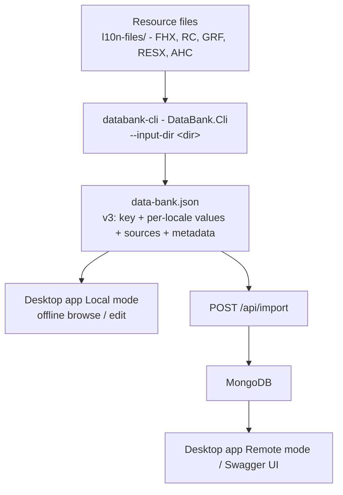
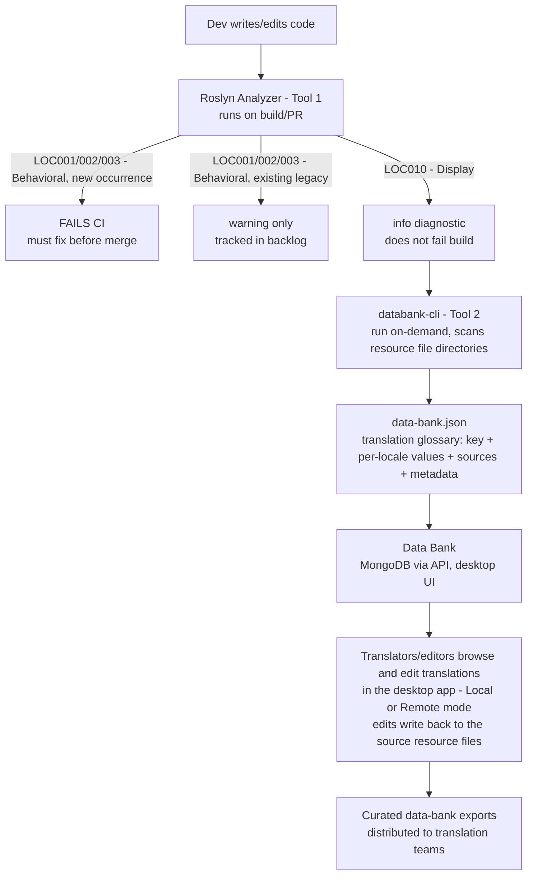

# DeltaV Localization Refactor - Consolidated Project Context

> **Single source of truth** for this initiative. Read before touching any code, tooling,
> or translation workflow. This file is written for both human engineers and AI coding
> agents. If you are an AI agent: treat this as ground truth over any assumptions from
> training data.

---

## 1. The Problem

DeltaV ships 5-10+ language versions. Historically, each language version has been
built as a **separate binary/image**, with its own full build process (some take hours).

**Root cause:** Localization-related strings drive business logic in the codebase:

```csharp
if (status == "Running") { ... }          // string literal gates control flow
var obj = db.Find("Start Pump");          // display text used as a DB lookup key
if (lang == "Chinese") { /* special-case behavior */ }
```

When a build fails for one locale because a translated string doesn't match what the
logic expects, the historical fix has been to **add more locale-specific branching**
(e.g., an `if` block that only exists for Chinese/Japanese builds). This compounds over time.

### Two kinds of strings

| Type | Definition | Example | Problem if hardcoded |
|---|---|---|---|
| **Display** | UI text, labels, log messages, dialogs | `button.Text = "Start Pump"` | Needs translation, but safe - doesn't break logic |
| **Behavioral** | Drives control flow, DB lookups, equality checks | `if (status == "Running")` | Translation **breaks the program**, forcing per-locale workarounds |

**Core fix:** Behavioral strings become invariant keys/enums that never change per locale.
Display strings are extracted into resource files and resolved client-side at runtime from a single build.

---

## 2. The Goal

- **One build process**, not one per language. Locale becomes runtime-loaded data (JSON pack), not a compile-time artifact.
- Localization strings **stop driving business logic** anywhere in the codebase.
- New code is prevented (via CI gate) from reintroducing this pattern.
- Existing legacy instances are found, tracked, and migrated incrementally.
- Translation quality improves because translators/AI have **DeltaV-specific context** for ambiguous terms.

---

## 3. The Two Tools

These are related but **should be built and reasoned about separately** - do not conflate them.

### Tool 1 - Static Analysis (Roslyn Analyzer) - Complete

**Location:** `src/` (see that folder's own README.md for build/usage details)

- Classifies string literals in C# source as **Behavioral** or **Display** using syntax-level heuristics.
- Emits standard Roslyn diagnostics (15 LOC rules + optional CA rules):
  - `LOC001` (Warning) - string literal in a conditional (if/switch/ternary)
  - `LOC002` (Warning) - string literal passed to a data-access/lookup call (Find/Get/Query)
  - `LOC003` (Warning) - string literal in an equality comparison (==/.Equals())
  - `LOC004` (Warning) - string concatenation in output context (Console, Debug, logging, UI)
  - `LOC005` (Warning) - hardcoded date/number format string
  - `LOC006` (Info) - string method called without StringComparison
  - `LOC007` (Warning) - hardcoded pluralization logic (ternary comparing Count/Length)
  - `LOC010` (Info) - display string not yet routed through `Localize(...)`
  - `LOC011` (Warning) - string interpolation in localizable context
  - `LOC012` (Warning) - hardcoded DateTime format without CultureInfo
  - `LOC013` (Info) - dynamic/computed resource keys
  - `LOC014` (Warning) - English-only pluralization logic
  - `LOC015` (Info) - punctuation concatenated outside translatable strings
- Includes a **CLI tool** (`SarifCli.cs`) for running analyzers outside the IDE, with per-file metrics (timing, size, line count).
- Includes a **WPF + WebView2 desktop app** (`LocalizationAnalyzers.Desktop/`) for GUI-based analysis with expandable row details.
- Diagnostics flow into **SARIF 2.1.0** (`dotnet build /p:ErrorLog=results.sarif`), which SonarQube and Azure DevOps both consume natively.
- **Enriched SARIF output**: Results include `classification`, `sourceSnippet`, and `stringLiteral` properties. Rules include `helpUri`, `tags`, `relatedRules`, and `example` (bad/good code snippets).
- Ships a code fix (lightbulb in IDE) that extracts a LOC010 string into a `Localize("suggested.key")` call.
- **CI strategy:** Gate builds on *new* LOC001-LOC003 occurrences only (diff against a committed SARIF baseline). Do not fail builds on the entire legacy backlog.

**Status:** Complete - 132 unit tests passing, NuGet package generated.

### Tool 2 - Extraction + Context (databank-cli) - Complete

**Location:** `DatabankTool/` (see `DatabankTool/README.md` for build/usage details)

The Databank pipeline scans raw resource files (`.resx`, `.rc`, `.fhx`, `.ahc`, `.json`,
`.grf`) - where the translatable strings live for the existing DeltaV assets - and turns
them into a structured Data Bank that translators and tools can work with.

**Input:** a directory of resource files (`--input-dir <path>`, e.g. `./l10n-files`).
Supported formats: `resx`, `rc`, `fhx`, `ahc`, `json`, `grf`. Locale is detected per file
(from filename or path, e.g. `Messages.fr.resx`, FHX `Translated/` folders). `.rc` files
can be resolved against a `resource.h` symbol map (`--resource-h`).

**Output: `data-bank.json` (version 3)** - entries grouped by key, one entry per key with
multi-locale values and source locations:

```json
{
  "version": 3,
  "generated": "2026-08-05T...",
  "basePath": "C:/.../l10n-files",
  "entries": [
    {
      "id": "IDS_WELCOME",
      "key": "IDS_WELCOME",
      "values": [
        { "locale": "en", "value": "Welcome" },
        { "locale": "zh-CN", "value": "欢迎" }
      ],
      "sources": {
        "en": { "format": "resx", "file": "Resources/EN/Messages.resx", "path": "...", "line": 12 }
      },
      "metadata": {
        "comment": null,
        "formatSpecifiers": [],
        "doNotTranslate": false,
        "isTranslated": true
      }
    }
  ],
  "translationSummary": { "totalKeys": 1234, "translatedKeys": 900, "untranslatedKeys": 334 }
}
```

Fields:
- `key` - the resource key (as found in the source file)
- `values[]` - one entry per locale; `value` is the localized string
- `sources{}` - per-locale origin: format, relative file path, line number
- `metadata` - `doNotTranslate`, `isTranslated`, `comment`, `formatSpecifiers`

The Data Bank is translator-centric: it answers "what does this term mean in our product,
and what are its translations?" - not "which file was this found in?" (that lives in the
source locations above, for developers).

**Sub-projects (all under `DatabankTool/`):**

| Project | Purpose |
|---------|---------|
| `DataBank.Cli` | Extraction CLI (`databank-cli`) - also has an `edit` subcommand that writes a translation back to the source file |
| `DataBank.Api` | ASP.NET Core REST API backed by MongoDB (import/export, CRUD, stats, sessions, extraction jobs) |
| `DataBank.Desktop` | WPF + WebView2 GUI - **Local mode** (load `data-bank.json` from disk) and **Remote mode** (connect to the API/MongoDB) |
| `DataBank.Import` | **Deprecated** - JSON-to-MongoDB importer; use `POST /api/import` instead |

**How they connect:**



---

## 4. The End-to-End Workflow



---

## 5. Current Implementation Status

| Piece | Status | Location |
|---|---|---|
| Tool 1 - Roslyn Analyzer (LOC001-LOC007, LOC010, LOC011-LOC015) + code fix | Complete - 132 tests passing, NuGet package generated | `src/` |
| Tool 1 - CLI with per-file metrics | Complete - SARIF 2.1.0 + invocations[] + fileMetrics[] | `src/SarifCli.cs` |
| Tool 1 - CLI enriched SARIF | Complete - classification, sourceSnippet, stringLiteral, rule metadata (helpUri, tags, examples) | `src/SarifCli.cs` |
| Tool 1 - Desktop App (WPF + WebView2) | Complete - GUI with expandable row details, rule toggles, CA rules, SARIF export | `src/LocalizationAnalyzers.Desktop/` |
| Tool 1 - SARIF to SonarQube/Azure DevOps integration | Complete - SARIF 2.1.0 compatible | `src/README.md` |
| Tool 1 - CI baseline-gate (fail only on new violations) | Documented approach, tooling not yet built | - |
| Tool 2 - `databank-cli` CLI (extraction from resource files) | Complete - resx/rc/fhx/ahc/json/grf parsers, grouping, stats, coverage, edit/write-back | `DatabankTool/DataBank.Cli` |
| Tool 2 - CLI tests | Complete - 178 tests passing | `DatabankTool/DataBank.Cli.Tests` |
| Tool 2 - Data Bank store (MongoDB + REST API) | Complete - CRUD, import/export, stats, sessions, Swagger | `DatabankTool/DataBank.Api` |
| Tool 2 - Desktop app (Local + Remote modes) | Complete - dashboard, filters, inline edit with write-back, JSON export, GRF tab | `DatabankTool/DataBank.Desktop` |

---

## 6. Open Questions / Decisions Still Needed

- Exact `Localize(...)` API/method signature to standardize on across the codebase.
- Tool 2 currently runs on-demand (CLI + desktop import); whether it should run on a
  schedule or on every PR is undecided.
- Ownership of the SARIF baseline file and who approves suppressions/exceptions for legacy violations.
- Which languages get AI-assisted translation vs. human-only.

---

## 7. Ground Rules

1. **Don't conflate the two tools.** Tool 1 classifies. Tool 2 extracts, stores, and contextualizes. Keep them as separate, composable pieces.
2. **Behavioral strings are the priority**, not display strings. A missed translation is a UX bug; a behavioral string is what's currently costing hours-long build times.
3. **Don't gate CI on the legacy backlog.** Only new violations should block merges.
4. **"Module" (and terms like it) are ambiguous across DeltaV components on purpose.** Any translation tooling must carry component-level context.
5. **The end state is one build.** Any solution that still requires a build step per language is not solving the actual problem.

---

## 8. Diagnostic Rules Reference

| Rule ID | Name | Severity | Description | CI Gate |
|---|---|---|---|---|
| `LOC001` | StringInConditional | Warning | String literal in if/switch/ternary condition | Yes (new only) |
| `LOC002` | StringInDataAccess | Warning | String literal passed to Find/Get/Query call | Yes (new only) |
| `LOC003` | StringInEquality | Warning | String literal in == or .Equals() comparison | Yes (new only) |
| `LOC004` | StringConcatenationInOutput | Warning | String concatenation in output context (Console, Debug, UI) | No |
| `LOC005` | HardcodedDateFormat | Warning | Hardcoded date/number format string | No |
| `LOC006` | MissingStringComparison | Info | String method called without StringComparison | No |
| `LOC007` | HardcodedPluralLogic | Warning | Hardcoded pluralization logic (ternary comparing Count) | No |
| `LOC010` | DisplayStringNotLocalized | Info | Display string not routed through Localize() | No |
| `LOC011` | StringInterpolationInLocalizableContext | Warning | Detects `$"..."` passed to localizer indexers or UI properties | No |
| `LOC012` | HardcodedDateTimeFormat | Warning | Detects DateTime.ToString with format strings without CultureInfo | No |
| `LOC013` | DynamicResourceKey | Info | Detects computed/dynamic keys in localizer indexers | No |
| `LOC014` | EnglishOnlyPluralization | Warning | Detects if/else and ternary pluralization with count comparisons | No |
| `LOC015` | PunctuationOutsideString | Info | Detects punctuation concatenated outside translatable strings | No |

---

## 9. DeltaV-Specific Classification Rules

**Display strings** (localizable, no CI gate):
- Alarm message text: `"Pressure high"` - display
- Status label: `"Running"` - display
- User prompt: `"Enter setpoint"` - display
- Error message to operator: `"Communication lost"` - display
- Report label: `"Module State"` - display

**Behavioral strings** (CI gate, requires review):
- Plant model state: `if (state == "Running")` - behavioral
- Control mode: `switch (mode) { "manual", "auto" }` - behavioral
- Alarm severity: `if (severity == "critical")` - behavioral
- Unit type: `if (unit == "pressure")` - behavioral
- Device type: `if (type == "module")` - behavioral

---

## 10. Context Disambiguation Problem

The word "module" appears in multiple DeltaV contexts:

| Context | Source Term | Correct Translation (FR) | Incorrect (No Context) |
|---------|-------------|--------------------------|------------------------|
| Physical device | `module` | `module` (keep English) | `modulo` (math) |
| Software component | `module` | `module` | `composant` |
| Control module | `control module` | `module de contrôle` | `module de commande` |
| Module type (unit) | `module` | `module` | `unité` |

**Translation context / glossary entries** carried in the Data Bank:

| Source | Target (FR) | Context | Definition | Notes |
|--------|-------------|---------|------------|-------|
| `module` | `module` | DeltaV physical device | Physical I/O or control device | Keep English |
| `control module` | `module de contrôle` | Software configuration | Logical grouping of control strategy | Not "module de commande" |
| `plant` | `usine` | Physical facility | Manufacturing facility | Not "plante" (plant organism) |
| `alarm` | `alarme` | Safety system | Safety notification | Not "alerte" (temporary warning) |
| `calibration` | `calibration` | Instrument setup | Device accuracy adjustment | Keep English, same in French |

---

## 11. Key Technical Decisions

1. **JSON over .resx**: Source of truth in JSON, consumed by runtime localization library. Enables tooling and AI processing.
2. **Behavioral = CI gate**: Only behavioral strings (logic-driven) block PRs. Display strings get warnings/info but don't block.
3. **Baseline-suppress legacy**: Only new LOC001-LOC003 violations block merges. Existing violations are warnings tracked in backlog.
4. **SARIF 2.1.0 as standard**: All analysis output in SARIF 2.1.0 format - required by both SonarQube and Azure DevOps. `dotnet build /p:ErrorLog=` produces 2.1.0 natively on modern .NET.
5. **DeltaV domain context**: Translation tooling explicitly defines DeltaV-specific meanings for ambiguous terms.
6. **Data Bank is translator-centric**: `data-bank.json` stores translation context (key, per-locale values, source locations, metadata), not code metadata. Code location stays in SARIF for developers; the data bank is for translators and AI-assisted translation.
7. **Extraction is resource-driven**: `databank-cli` scans existing resource files (resx/rc/fhx/ahc/json/grf) to find translatable strings; no analyzer/SARIF dependency.
8. **Flat JSON format**: Resource files use flat key-value pairs. Simpler to generate and merge; nested format can be added later if needed.

---

## 12. Resource File Convention

**Location:** `Resources/{locale}.json`

**Naming examples:**
```
Resources/en.json        # English (source language)
Resources/fr.json        # French
Resources/de.json        # German
Resources/zh.json        # Chinese
```

**Flat key format (primary):**
```json
{
  "PumpController.InitializeUI.startpump": "Start Pump",
  "AlarmSystem.CheckPressure.pressurehigh": "Pressure high",
  "ErrorHandler.ShowDialog.devicenotfound": "Device '{0}' not found"
}
```

Flat keys are simpler to generate, merge, and deduplicate.

**Nested key format (alternative):**
```json
{
  "plant.model.state": {
    "idle": "Idle",
    "running": "Running",
    "faulted": "Faulted"
  },
  "control.module.mode": {
    "manual": "Manual",
    "auto": "Automatic"
  }
}
```

Nested format is more human-readable for large key sets but harder to merge automatically. Can be adopted later if the team prefers it - a flat-to-nested converter is straightforward.

---

## 13. Implementation Phases

### Phase 1: Foundation (Week 1-2)
1. Create Roslyn Analyzer project (`src/`)
2. Implement LOC001 (StringInConditional) and LOC002 (StringInDataAccess)
3. Write unit tests with `Microsoft.CodeAnalysis.Testing`
4. Create `Resources/en.json` with existing string keys

### Phase 2: Classification (Week 3-4)
5. Implement ClassificationEngine with rule-based logic
6. Implement LOC003 (StringInEquality) and LOC010 (DisplayStringNotLocalized)
7. Implement CodeFixProvider for auto-extraction

### Phase 3: CI/CD Integration (Week 5-6)
8. Configure SARIF generation in pipeline
9. Implement baseline-gate script (diff against committed baseline)
10. Define the translation consumption workflow (data-bank exports, runtime resource packs)

### Phase 4: Production Rollout (Week 7-8)
11. Run analyzer on full DeltaV codebase, categorize all strings
12. Extract Display strings to `Resources/en.json`
13. Enable quality gates on PRs

---

## 14. Success Metrics

| Metric | Target | Measurement |
|--------|--------|-------------|
| New behavioral strings blocked | 100% | CI gate enforcement |
| Display strings extracted | 90%+ | `Resources/en.json` coverage |
| Translation context accuracy | 95%+ | Data Bank glossary usage |
| AI translation quality | 90%+ | Human review of first batch |
| Build processes | 1 (was 5-10+) | Pipeline count |