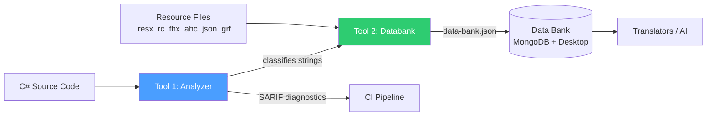
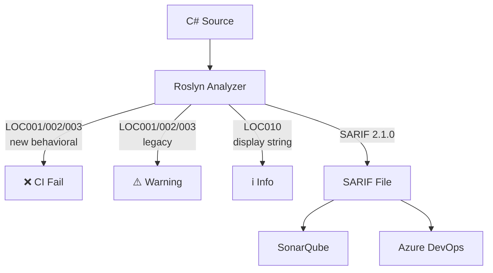
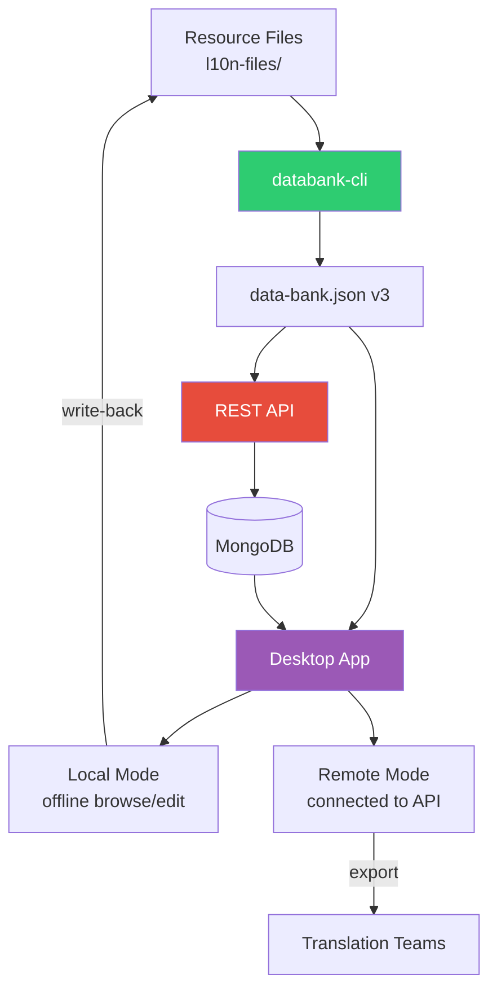
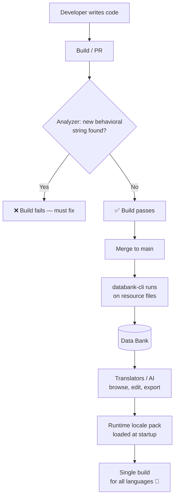

# DeltaV Localization Tools — PRD

> Single source of truth for this initiative. Read before touching any code, tooling,
> or translation workflow.

---

## Problem

DeltaV ships 5-10+ language versions. Each is built as a **separate binary** with its own
full build process (some take hours). The root cause: **localization strings drive
business logic**:

```csharp
if (status == "Running") { ... }          // string literal gates control flow
var obj = db.Find("Start Pump");          // display text used as a DB lookup key
if (lang == "Chinese") { /* special-case */ }  // per-locale branching
```

Strings fall into two categories:

| Type | What it is | Risk |
|------|-----------|------|
| **Display** | UI text, labels, log messages | Needs translation, but safe — doesn't break logic |
| **Behavioral** | Drives control flow, DB lookups, equality checks | Translation **breaks the program**, forcing per-locale workarounds |

Each locale-specific workaround compounds over time, making builds slower and the codebase harder to maintain.

---

## Goal

- **One build process** — locale becomes runtime-loaded data, not a compile-time artifact
- **Behavioral strings stop driving business logic** — extracted into invariant keys/enums
- **CI gate** prevents new behavioral strings from being introduced
- **Existing violations** are found, tracked, and migrated incrementally
- **Translation quality improves** with DeltaV-specific context for ambiguous terms

---

## Solution Overview

Two independent, composable tools:



### Tool 1 — Static Analyzer (LocalizationAnalyzer)

Roslyn-based analyzer that classifies string literals as **behavioral** or **display**
using syntax-level heuristics. Emits 13 diagnostic rules (LOC001–LOC015) with SARIF 2.1.0
output compatible with SonarQube and Azure DevOps.



Key capabilities:
- **Code fix** — extracts unlocalized display strings into `Localize("key")` calls
- **Desktop app** — WPF + WebView2 GUI for browsing results with expandable row details
- **CLI** — `SarifCli` for running outside the IDE with per-file metrics

### Tool 2 — Databank Pipeline (DatabankTool)

Scans raw resource files and produces a structured **Data Bank** — a translation glossary
with per-locale values, source locations, and metadata.



**data-bank.json** structure (v3):
```json
{
  "version": 3,
  "entries": [{
    "id": "IDS_WELCOME",
    "values": [
      { "locale": "en", "value": "Welcome" },
      { "locale": "zh-CN", "value": "欢迎" }
    ],
    "sources": {
      "en": { "format": "resx", "file": "Resources/EN/Messages.resx", "line": 12 }
    },
    "metadata": { "doNotTranslate": false, "isTranslated": true }
  }]
}
```

---

## End-to-End Workflow



---

## DeltaV Context — The "Module" Problem

The word "module" has different meanings across DeltaV components. Without context,
translations are wrong:

| Context | Source Term | Correct (FR) | Incorrect (No Context) |
|---------|------------|--------------|------------------------|
| Physical device | `module` | `module` (keep English) | `modulo` (math) |
| Software component | `module` | `module` | `composant` |
| Control module | `control module` | `module de contrôle` | `module de commande` |

The Data Bank carries **component-level context** (definition, notes) to disambiguate.

---

## Diagnostic Rules

| Rule | What it catches | Severity | CI Gate |
|------|----------------|----------|---------|
| **LOC001** | String in conditional (if/switch/ternary) | Warning | ✅ New only |
| **LOC002** | String passed to data-access call (Find/Get/Query) | Warning | ✅ New only |
| **LOC003** | String in equality comparison (==/.Equals()) | Warning | ✅ New only |
| LOC004 | String concatenation in output context | Warning | — |
| LOC005 | Hardcoded date/number format | Warning | — |
| LOC006 | String method without StringComparison | Info | — |
| LOC007 | Hardcoded pluralization logic | Warning | — |
| LOC010 | Display string not routed through Localize() | Info | — |
| LOC011 | String interpolation in localizable context | Warning | — |
| LOC012 | DateTime.ToString without CultureInfo | Warning | — |
| LOC013 | Dynamic/computed resource keys | Info | — |
| LOC014 | English-only pluralization | Warning | — |
| LOC015 | Punctuation outside translatable string | Info | — |

---

## Key Decisions

1. **JSON over .resx** — Source of truth in JSON, consumed by runtime localization library
2. **Behavioral = CI gate** — Only logic-driven strings block PRs
3. **Baseline-suppress legacy** — Only new LOC001-003 violations block merges
4. **SARIF 2.1.0** — Standard output format for SonarQube and Azure DevOps
5. **Data Bank is translator-centric** — Stores translation context, not code metadata
6. **Extraction is resource-driven** — Scans existing resource files; no analyzer dependency

---

## Status

| Component | Status | Tests |
|-----------|--------|-------|
| Roslyn Analyzer (13 rules + code fix) | ✅ Complete | 126 passing |
| CLI with SARIF output | ✅ Complete | — |
| Desktop app (WPF + WebView2) | ✅ Complete | — |
| databank-cli (6 format parsers) | ✅ Complete | 194 passing |
| REST API (MongoDB) | ✅ Complete | — |
| Desktop app (Local + Remote) | ✅ Complete | — |
| CI baseline-gate | 📄 Documented | Not yet built |

---

## Ground Rules

1. **Don't conflate the tools.** Tool 1 classifies. Tool 2 extracts and stores.
2. **Behavioral strings are the priority.** A missed translation is UX; behavioral strings cost hours of build time.
3. **Don't gate on legacy backlog.** Only new violations block merges.
4. **"Module" is ambiguous on purpose.** Tooling must carry component-level context.
5. **End state is one build.** Solutions requiring per-language builds don't solve the problem.
